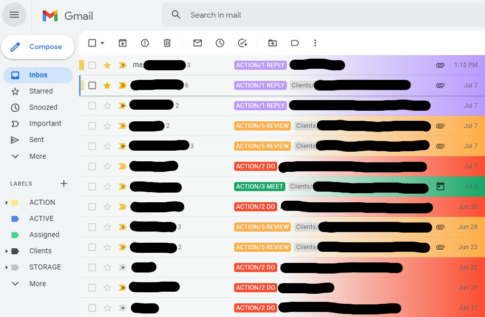

# STACKEDmail

Tweak Gmail to work better with STACK method, a process for working through your email faster in batches. Visit the [STACK Method website](www.stackmethod.com) to learn how to use it.

Categories pre-defined in STACK are given special treatment in your inbox, and are decked out with gradient backgrounds that match your STACK labels. If you have more STACK categories than the default list, the CSS provides quick instructions on how to add support for your other labels.

*NOTE: This CSS uses features not yet enabled by default in most browsers. In Chrome, go to  the [Experimental Web Platform Features flag](chrome://flags/#enable-experimental-web-platform-features) and select Enable. If you are not using Chrome, see [:has at CanIUse.com](https://caniuse.com/?search=%3Ahas) to see if this stylesheet can be used in your browser.*

## SETUP
### Gmail
Create labels with the following names, hierarchy and colors:

- ACTION (bold yellow)
    - 1 REPLY (bold purple)
    - 2 DO (bold red)
    - 3 MEET (bold green)
    - 4 FORWARD (bold pink)
    - 5 REVIEW (bold orange)
- ACTIVE (bold blue)
- STORAGE (light grey)

Feel free to add labels, get rid of labels, change colors or change names. Any changes you make here will need to be adjusted in the CSS (don't worry, there's templates you can copy and paste in the code).